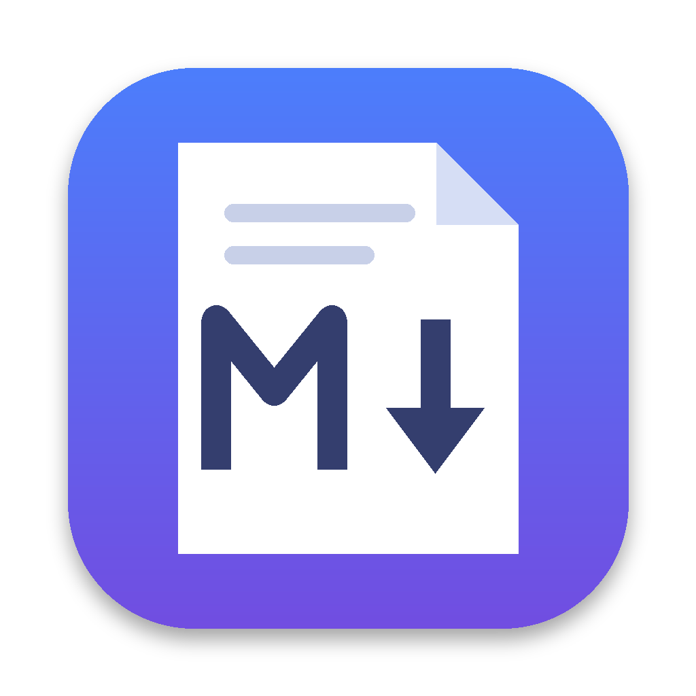
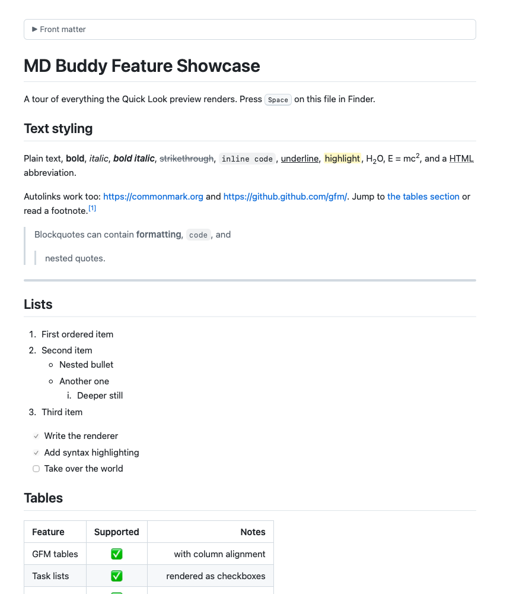
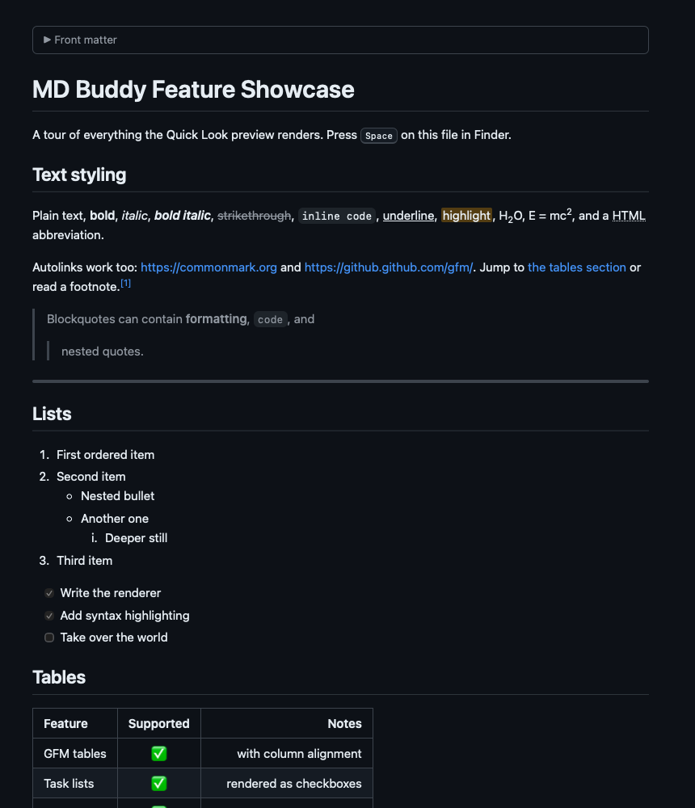
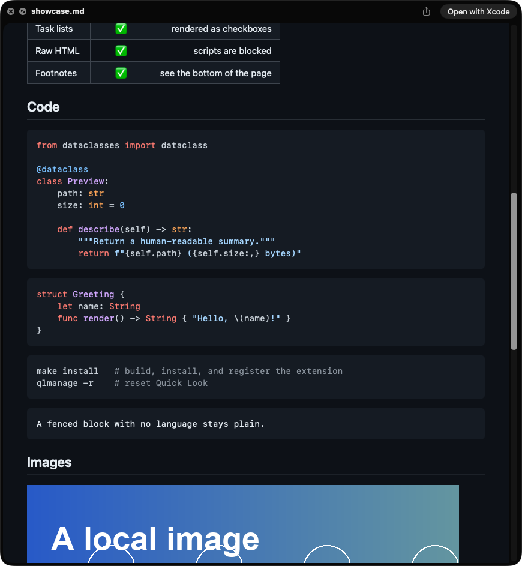
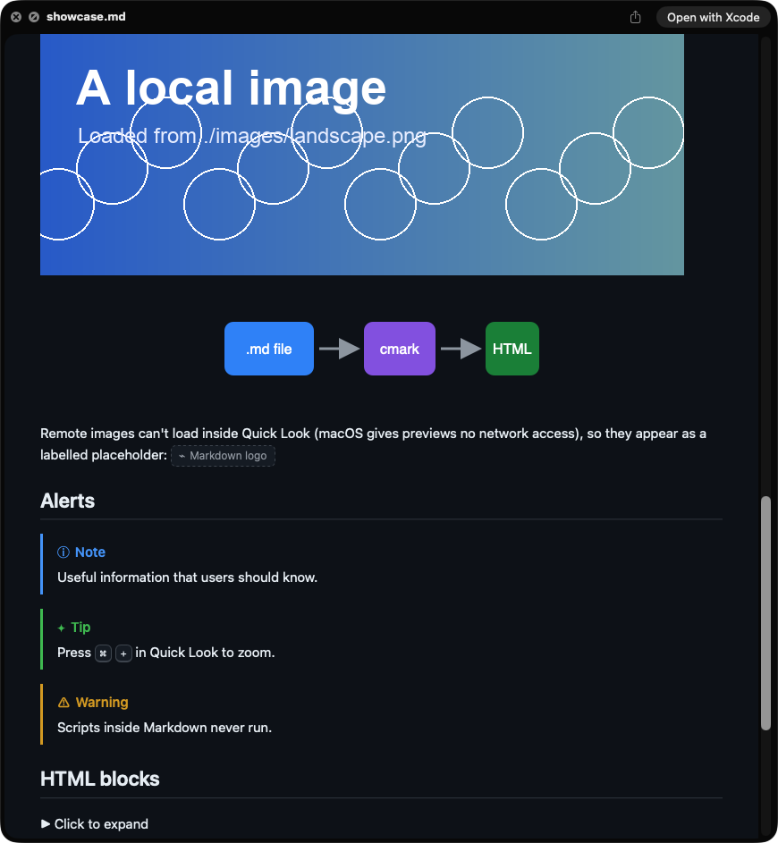
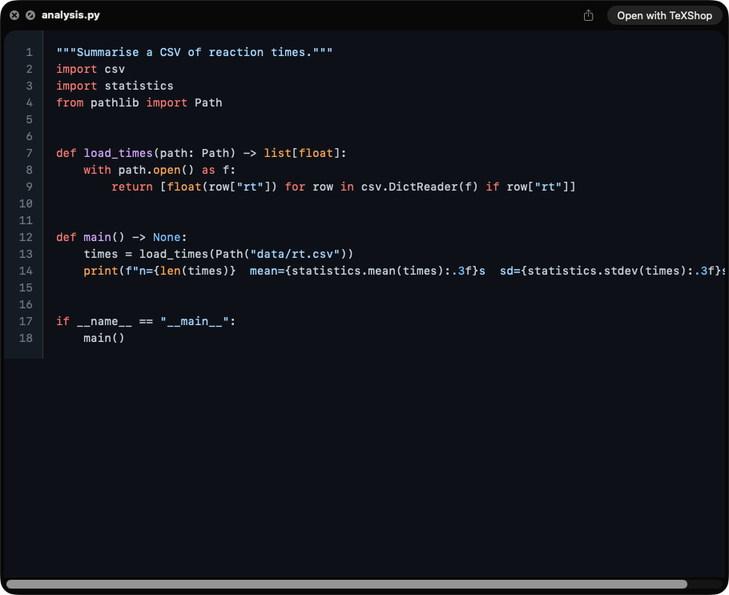
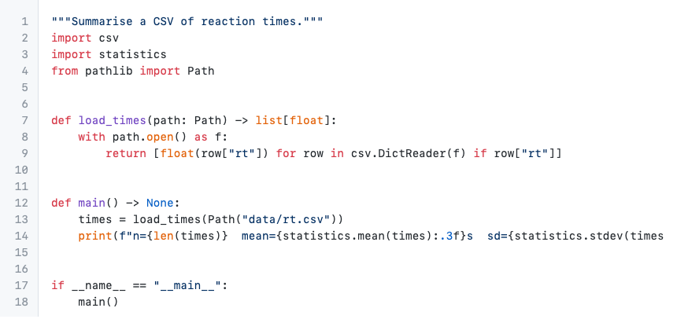

<p align="center"></p>

<h1 align="center">MD Buddy</h1>

<p align="center">Quick Look previews for Markdown, source code and plain text on macOS.<br>
Select a file in Finder, press <kbd>Space</kbd>, and read it rendered.</p>

<p align="center">
  
  
</p>

MD Buddy is a Quick Look preview extension written from scratch in Swift. Markdown is parsed
natively with [cmark-gfm](https://github.com/swiftlang/swift-cmark), GitHub's C implementation of
CommonMark, and shown in a WebKit view styled like GitHub. Code is highlighted with a bundled copy
of [highlight.js](https://highlightjs.org). The installed app is 1 MB and has no runtime
dependencies.

## Features

**Markdown** (CommonMark plus GitHub Flavored Markdown)

- Headings, **bold**, *italic*, ~~strikethrough~~, `inline code`, links and autolinks
- Tables with column alignment, task lists, footnotes, nested lists and blockquotes
- Fenced code blocks with syntax highlighting for about 55 languages
- Images next to the file (``), including SVG
- Raw HTML: `<details>`, `<kbd>`, `<sub>`/`<sup>`, `<mark>`, ``, `<dl>`, aligned
  paragraphs and so on
- GitHub alerts (`> [!NOTE]`, `[!TIP]`, `[!IMPORTANT]`, `[!WARNING]`, `[!CAUTION]`)
- YAML (`---`) and TOML (`+++`) front matter, shown as a collapsible block
- Heading anchors, so in-page links such as `[see below](#tables)` scroll the preview
- `.md`, `.markdown`, `.mdown`, `.mkd`, `.mkdn`, `.mdwn`, `.mdtext`, `.mdtxt`, `.Rmd`, `.qmd`

**Source code**: line numbers and highlighting for Python, R, Julia, MATLAB, C/C++,
Objective-C, Swift, Go, Rust, Java, Kotlin, Scala, JavaScript, TypeScript (`.tsx`), shell
scripts, SQL, LaTeX/BibTeX, YAML, TOML, JSON, CSS/SCSS, Makefiles, Dockerfiles and more. The
full list of extensions is `LanguageMap` in
[`DocumentKind.swift`](Core/Sources/MDBuddyCore/DocumentKind.swift).

**Plain text**: `.log` and other text files, in a monospaced font with soft wrapping.

Everything follows the system's light or dark appearance. Links open in your browser. Pinch
to zoom a preview.

### Code font size

Code, fenced code blocks and plain text are shown at 14 px. To change that, set macOS's
fixed-pitch font size, which MD Buddy reads if you have set it:

```bash
defaults write -g NSFixedPitchFontSize -float 16    # any size from 8 to 48
defaults delete -g NSFixedPitchFontSize             # back to MD Buddy's 14 px
```

The new size applies to the next file you preview. This is the Cocoa "user fixed-pitch font"
setting (`NSFont.userFixedPitchFont`); System Settings has no control for it, and any other app
that asks macOS for the user's fixed-pitch font gets the same size. When it isn't set, macOS
reports 11 pt; MD Buddy ignores that fallback and uses 14 px.

<table>
  <tr>
    <td></td>
    <td></td>
  </tr>
  <tr>
    <td align="center">Tables and code blocks</td>
    <td align="center">Local images, SVG and alerts</td>
  </tr>
  <tr>
    <td></td>
    <td></td>
  </tr>
  <tr>
    <td align="center">A Python file (dark)</td>
    <td align="center">The same file (light)</td>
  </tr>
</table>

The screenshots in the first three cells are real Finder Quick Look panels, captured by
[`scripts/screenshots.sh`](scripts/screenshots.sh).

## Install

You need macOS 13 or later (developed and tested on macOS 26.6) and [Xcode](https://apps.apple.com/app/xcode/id497799835) (the full
app; the Command Line Tools alone cannot build an app extension).

```bash
git clone https://github.com/ContextLab/md-buddy.git
cd md-buddy
make install
```

`make install` builds the app, copies it to `/Applications/MD Buddy.app`, registers the Quick
Look extension and resets Quick Look's cache. Then select a Markdown or code file in Finder and
press <kbd>Space</kbd>.

To install somewhere else: `scripts/install.sh --prefix ~/Applications`.

If previews don't change, open **System Settings › General › Login Items & Extensions**,
scroll to the *Extensions* list, click ⓘ next to **MD Buddy** and make sure Quick Look is
switched on. Opening `MD Buddy.app` shows the same instructions and a button that opens that
pane.

### Sharing a build with someone who doesn't have Xcode

`make dist` writes `dist/MD-Buddy-<version>.zip`. The app is signed ad hoc, not notarized, so
after unzipping it into `/Applications` the recipient has to clear the quarantine flag and open
it once:

```bash
xattr -dr com.apple.quarantine "/Applications/MD Buddy.app"
open "/Applications/MD Buddy.app"
```

## Uninstall

```bash
make uninstall
```

This removes `/Applications/MD Buddy.app`, unregisters the extension and resets Quick Look.

## Limitations

- **Files macOS keeps for itself.** Quick Look never hands some types to third-party
  extensions. On macOS 26.6, `.txt` files always get the system's text preview, and `.ts` and
  `.mts` are typed as MPEG-2 video, so they get the video preview (the
  [Syntax Highlight](https://github.com/sbarex/SourceCodeSyntaxHighlight) project documents the
  same for `.ts`, `.mts` and `.html`). MD Buddy leaves `.html`, `.csv`, `.svg`, `.plist` and
  `.xml` to the system's own previewers. Files with no extension (`README`, `LICENSE`) are plain text as far
  as macOS is concerned, so they get the system's text preview.
- **Remote images.** Quick Look gives preview extensions no network access, so an image
  loaded from `https://…` shows as a labelled placeholder with its alt text. Images stored
  next to the file work.
- **Math and diagrams.** `$…$` math and Mermaid blocks appear as written, not typeset.
- **Scripts never run.** Raw `<script>`, `<iframe>` and `<style>` tags are neutralised (GitHub
  does the same), inline event handlers such as `onerror=` are blocked by the page's Content
  Security Policy, and `javascript:` links do nothing.
- **Large files.** Files over 8 MB are cut to their first 8 MB with a notice. Code over 1 MB is
  shown without highlighting, because highlight.js would make the preview slow to appear.

## How it works

```
Finder ── Space ──▶ Quick Look ──▶ MD Buddy Preview.appex
                                       │
                 PreviewDocument ◀─────┘  read file, decode text (UTF-8/16/32, Latin-1…)
                  ├─ Markdown ─▶ cmark-gfm ─▶ HTML
                  ├─ code     ─▶ line-numbered <pre>, highlight.js
                  └─ text     ─▶ wrapped <pre>
                        │
                        ▼
                 one self-contained HTML page (inline CSS + JS, CSP with a nonce)
                        │
                        ▼
                 WKWebView ── mdbuddy-local:///path/… ──▶ images beside the file
```

- Parsing is native: cmark-gfm turns Markdown into HTML in C. On this Mac, the
  `mdbuddy-render` tool converts a 1.1 MB Markdown file (the showcase repeated 400 times) to a
  finished page in 0.10 s of wall-clock time, process start included (3 runs, Apple M2 Max,
  macOS 26.6).
- highlight.js (about 180 KB) is included only in pages
  that contain code; plain text gets no script at all.
- The page's base URL is the document's folder under a private
  `mdbuddy-local:` scheme, so a relative `src` resolves to the file beside the document and
  the extension reads it from disk.
- Quick Look sends a file to an extension only when the file's exact
  type identifier is listed, and many code extensions have no type on a stock Mac.
  [`scripts/gen_types.py`](scripts/gen_types.py) derives both lists from `LanguageMap`, and
  `RoutingTests` checks every extension against the installed system.

## Development

```
App/                 host app (carries the extension; declares file types)
PreviewExtension/    the Quick Look extension (QLPreviewingController + WKWebView)
Core/                Swift package: renderer, resources, mdbuddy-render CLI, tests
examples/            showcase.md, code and text samples used by tests and screenshots
scripts/             install, uninstall, screenshots, type generation, icon
```

| Command | What it does |
|-|-|
| `make test` | Run the test suite (`swift test` in `Core/`) |
| `make install` | Build, sign ad hoc, install and register |
| `make project` | Regenerate `MDBuddy.xcodeproj` from `project.yml` (needs `brew install xcodegen`) |
| `make screenshots` | Recapture `docs/screenshots/` from live Finder Quick Look panels |
| `make dist` | Zip the built app into `dist/` |
| `python3 scripts/gen_types.py` | Regenerate the declared and claimed file types after editing `LanguageMap` |

The tests use real inputs throughout: they render the files in `examples/`, load pages in
WebKit to check heading anchors, alerts, highlighting, image loading and script blocking, and
ask LaunchServices whether each known extension routes to the installed extension.
`RoutingTests` is skipped when MD Buddy isn't installed.

`mdbuddy-render` renders a file outside Quick Look, which helps when working on the styles:

```bash
swift run --package-path Core mdbuddy-render examples/showcase.md > /tmp/page.html
swift run --package-path Core mdbuddy-render examples/showcase.md --png /tmp/page.png --full --appearance light
swift run --package-path Core mdbuddy-render examples/showcase.md --eval 'document.title'
```

The screenshot script drives Finder with AppleScript, so the terminal running it needs
**Screen Recording** and **Accessibility** permission (System Settings › Privacy & Security).

### Troubleshooting

```bash
pluginkit -m -v -i org.contextlab.mdbuddy.preview   # is the extension registered? "+" means enabled
qlmanage -r && qlmanage -r cache                      # reset Quick Look
qlmanage -p examples/showcase.md                      # preview a file from the terminal
```

If another Markdown Quick Look app is installed, macOS may keep using it; remove it or switch
it off in the Quick Look extensions pane.

## License

MIT, see [LICENSE](LICENSE). MD Buddy bundles cmark-gfm (BSD-2-Clause) and highlight.js
(BSD-3-Clause); their notices are in [THIRD_PARTY_NOTICES.md](THIRD_PARTY_NOTICES.md).
