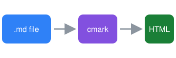

# MD Buddy Feature Showcase

A tour of everything the Quick Look preview renders. Press <kbd>Space</kbd> on this file in Finder.

## Text styling

Plain text, **bold**, *italic*, ***bold italic***, ~~strikethrough~~, `inline code`,
<u>underline</u>, <mark>highlight</mark>, H<sub>2</sub>O, E = mc<sup>2</sup>, and a
<abbr title="HyperText Markup Language">HTML</abbr> abbreviation.

Autolinks work too: https://commonmark.org and <https://github.github.com/gfm/>.
Jump to [the tables section](#tables) or read a footnote.[^1]

> Blockquotes can contain **formatting**,
> `code`, and
>
> > nested quotes.

---

## Lists

1. First ordered item
2. Second item
   - Nested bullet
   - Another one
     1. Deeper still
3. Third item

- [x] Write the renderer
- [x] Add syntax highlighting
- [ ] Take over the world

## Tables

| Feature        | Supported | Notes                          |
|:---------------|:---------:|-------------------------------:|
| GFM tables     | ✅        | with column alignment          |
| Task lists     | ✅        | rendered as checkboxes         |
| Raw HTML       | ✅        | scripts are blocked            |
| Footnotes      | ✅        | see the bottom of the page     |

## Code

```python
from dataclasses import dataclass

@dataclass
class Preview:
    path: str
    size: int = 0

    def describe(self) -> str:
        """Return a human-readable summary."""
        return f"{self.path} ({self.size:,} bytes)"
```

```swift
struct Greeting {
    let name: String
    func render() -> String { "Hello, \(name)!" }
}
```

```bash
make install   # build, install, and register the extension
qlmanage -r    # reset Quick Look
```

```
A fenced block with no language stays plain.
```

## Images


<p align="center"></p>

## Alerts

> [!NOTE]
> Useful information that users should know.

> [!TIP]
> Press <kbd>⌘</kbd> <kbd>+</kbd> in Quick Look to zoom.

> [!WARNING]
> Scripts inside Markdown never run.

## HTML blocks

<details>
<summary>Click to expand</summary>

Hidden content with **Markdown** inside.

</details>

<dl>
  <dt>Definition list</dt>
  <dd>Rendered from raw HTML.</dd>
</dl>

<script>document.body.innerHTML = "script ran (this should never appear)";</script>

### Heading level 3
#### Heading level 4
##### Heading level 5
###### Heading level 6

[^1]: Footnotes are collected at the end of the document.
